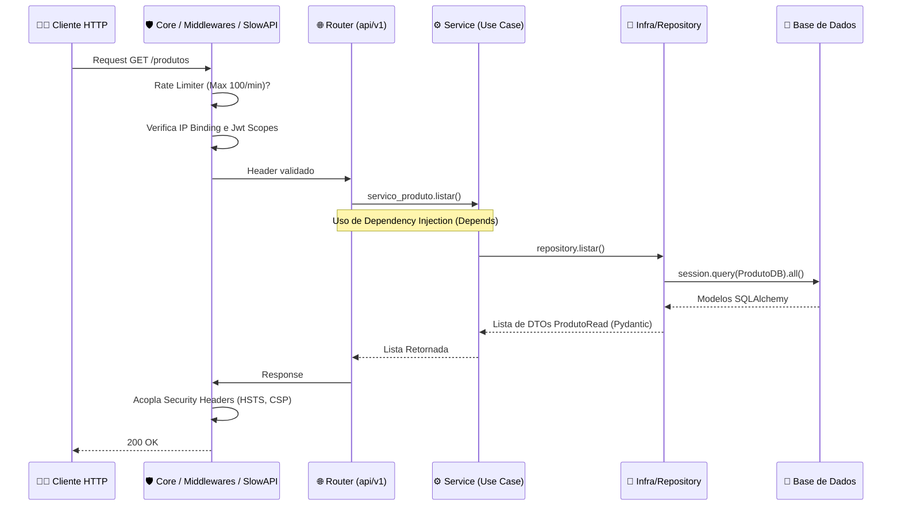

# API RESTful Autenticada – Clean Architecture & FastAPI
> **Um Padrão Ouro para Microsserviços Escaláveis e Seguros.**

[](https://fastapi.tiangolo.com/)
[](https://pydantic.dev/)
[](https://www.sqlalchemy.org/)
[](https://oauth.net/2/)

Esta aplicação é uma API RESTful projetada para oferecer **Excelência Técnica, Segurança Extrema e Alta Manutenibilidade**. Ela foge das implementações "rápidas" (monolíticas) e emprega filosofias rígidas de engenharia de software – com orquestração independente do banco de dados, tratamento contido de modelos nativos HTTP, Injeção de Dependências e proteção forte contra vetores de ataque em rede.

---

## 🏛️ Arquitetura do Sistema: Clean Architecture

A adoção da **Clean Architecture (Arquitetura Limpa)** baseia-se na separação estrita de responsabilidades ("Separation of Concerns"). O núcleo das regras de negócios não tem, nem deve ter, conhecimento da tecnologia aplicada na ponta (FastAPI) ou no banco (SQLAlchemy).

### Árvore de Diretórios
```text
D:\API-RESTful-simples-com-FastAPI...
├── app/
│   ├── api/
│   │   └── v1/endpoints/      # (Camada de Apresentação HTTP). Controladores REST / Endpoints base (FastApi).
│   ├── core/                  # (Transversal). Middlewares, Security, Rate Limiter (SlowApi) e Loggers.
│   ├── domain/                # (Domínio). Esqueleto corporativo da app: Interfaces DTOs (Pydantic V2) e Custom Exceptions.
│   ├── infra/                 # (Camada de Detalhe/Infra). Persistência de Dados.
│   │   ├── database.py        # Boot e Sessions do SQLAlchemy.
│   │   ├── models_db.py       # Representação Declarativa Base das Tabelas estruturais do banco (ORM).
│   │   └── repositories/      # Padrão Repository SQL. Executam consultas baseadas na Session abstrata.
│   ├── services/              # (Casos de Uso) Orquestra a injeção do repositório, valida regra de negócios e logs.
│   └── main.py                # App Central, Exception Handlers Globais e Lifespan de Boot.
│
├── pytest.ini                 # Configuração padrão do executor do pytest
├── test_.py                   # Testes de integração base
└── pyproject.toml             # Gestão determinística de dependências modulares nativas.
```

> 💡 **Por que fazemos assim?**
> A dissociação nos impede de misturar validação de dados de entrada (`request HTTP`) com manipulação das tabelas (`DB Query`). Quando usamos Pydantic para validação HTTP e SQLAlchemy para o Banco, sem a camada `services/` ou `repositories/`, mudarmos no futuro o banco para Postgres ou MongoDB demandaria quebrar todo o core do Endpoits/Router. Encapsulamos a vida util da tecnologia na "borda" permitindo que regras de negócio persistam intactas, puras em python.

### Entendendo as Camadas:
Para garantir a escalabilidade e a manutenção a longo prazo, este projeto adota os princípios da Clean Architecture, mas faz uma adaptação consciente aos padrões estabelecidos pela comunidade do FastAPI.

Abaixo, detalhamos a responsabilidade de cada diretório:

* app/domain/ (O Verdadeiro Núcleo de Negócios): Na teoria purista da Clean Architecture, o "core" é o domínio da aplicação. Aqui, essa camada contém as estruturas de dados fundamentais independentes de tecnologia externa. Estão localizados os DTOs validados via Pydantic (models.py) e as Exceções Customizadas (exceptions.py) que representam as regras intransigíveis do negócio.

* app/services/ (Casos de Uso): É o cérebro das operações. Os serviços recebem as injeções de dependência da infraestrutura (como os repositórios) e executam a lógica de negócio. Eles garantem que a apresentação (API) não contenha regras corporativas e que o banco de dados não dite o comportamento da aplicação.

* app/api/ (Camada de Apresentação HTTP): Lida exclusivamente com o tráfego da web. Define os endpoints, recebe os requests, repassa os dados para a camada de serviços processar e devolve os responses formatados. Não possui conhecimento sobre SQL ou regras de validação profundas.

* app/infra/ (Infraestrutura e Persistência): A camada mais externa e volátil. É responsável por falar com o mundo externo, focando especificamente na persistência de dados. Contém os arquivos do banco de dados, os modelos declarativos do SQLAlchemy (models_db.py) e os Repositórios que isolam as consultas SQL (query) do resto do sistema.

**⚠️ Nota Importante sobre a camada app/core/:**

Se você é um estudioso purista da Clean Architecture (Uncle Bob), pode achar estranho encontrar JWT, limitadores de taxa e middlewares dentro de uma pasta chamada "Core" (que teoricamente deveria ser agnóstica de tecnologia).

No entanto, este projeto segue a convenção oficial da comunidade FastAPI. Neste contexto, o diretório core/ atua como uma camada transversal de configurações centrais do framework, e não como o núcleo das regras de negócio (papel exercido pelo domain). É no core/ que alocamos a base operacional da tecnologia web, como o motor de segurança (security.py), proteção de endpoints (middlewares.py), limitadores de fluxo de rede (rate_limit.py) e configurações de ambiente (config.py).

### Fluxo de Requisição (Mermaid Workflow)



---

## 🛠️ Stack Tecnológica Exaustiva

*   **Fundação Web**: FastAPI (Baseado em Starlette e Pydantic).
*   **Camada O.R.M (Persistência)**: SQLAlchemy v2+ atuando sobre SQLite nativo.
*   **Validação e Mapeamento de Domínio**: Pydantic V2 (`json_schema_extra` e `from_attributes`).
*   **Autenticação e Permissões**: Padrão JWT (JSON Web Tokens) usando protocolo OAuth2.0 via `python-jose[cryptography]` e Criptografia Hash com `passlib/Bcrypt`.
*   **SecOps (Rate & Tracking)**: Custom Middlewares + `SlowApi` Limiters nativos.
*   **Ambiente e Gerência**: Pip/Venv nativo sobre `pyproject.toml` (Build System standard).
*   **Testes e Stress**: Pytest e Locust.

---

## 🚀 Guia de Instalação e Execução

### 1. Criando e Acionando o Isolamento do Ambiente (Venv)
```bash
# Crie o ambiente (se estiver partindo do zero)
python -m venv .venv

# Ativador no Windows (PowerShell)
.venv\Scripts\activate
# No Linux/Mac: source .venv/bin/activate
```

### 2. Dependências
Todo o controle do ambiente está formalizado via PEP-621 e Setuptools no `pyproject.toml`.
Para inflar as dependências corretas em modo de edição (incluindo testes):
```bash
pip install -e .[dev]
```
*Isto engatilha o Uvicorn, SlowApi, Pydantic-Settings e Pydantic v2 nativamente.*

### 3. Rodar o Servidor
Mova-se para a raiz onde está os arquivos primários e acione a CLI nova do projeto:
```bash
fastapi dev app/main.py
# Opcional (Modo Antigo Uvicorn): uvicorn app.main:app --reload
```
Acesse sua interface completa e testável (Padrão Swagger) em: `http://127.0.0.1:8000/docs`

---

## 🛡️ Camadas de Segurança Fortificadas
O sistema possui 4 muralhas frontais contra vulnerabilidades modernas da camada de aplicação e de persistência cibernética.

### 1. Sistema OAuth2, Scopes e Proteção Token (IP Binding)
A autorização requer Scopes detalhados (`read`, `write`, `delete`). Cada função injetável do FastAPI possui um requerimento estrito amarrado: `Security(verificar_permissoes, scopes=["delete"])`. O JWT não transitará permissões indevidas.
Adicionalmente, foi incluída uma regra **Anti-hijacking via IP Binding**: O IP da máquina do cliente e assinado no Playload de criação do Token, se alguém interceptar esse Token num *man-in-the-middle* e tentar usá-lo em uma máquina secundária de IP distinto, ele será revogado com `403 Forbidden`.

> 💡 **Por que fazemos assim?**
> A segregação de permissões é vital para aderência a protocolos SOC/PCI-DSS. Limitar por granularidade minimiza danos colaterais drásticos caso uma credencial temporária ou fraca escape. IP Binding impede brechas clássicas de Session-Stealming.

### 2. Rate Limiting Restritivo (SlowAPI)
- Endpoint primário (Autenticação `/token`): Limitado **5/minuto**. Garante um "fail early" sem acionar cálculos matemáticos custosos na API.
- Endpoints de App (`/produtos`): Carga de banda regular liberada a **100/minuto**.
- Implementado via Middleware interceptor central para rejeitar os flooders com `HTTP 429 Too Many Requests`.

### 3. Mitigador de Brute-Force Interno
Caso o atacante tente mascarar/mudar IPs por requisições espaçadas (`< 5 rpm`), criamos o rastreador orgânico local `FALHAS_DE_LOGIN_POR_IP`.
Após bater a décima falha via tentativa e erro das hashes de Bcrypt num único IP, a sessão suspende indefinidamente os retornos pra ele, travando tentativas via bots burros em rotas vazáveis.

### 4. Cabeçalhos de Segurança Obrigatórios da Net (Sec. Headers)
Os cabeçalhos bloqueadores de "clickjacking" e manipulação MIME são ejetados dinamicamente no Interceptor do BaseHTTPMiddleware:
- `Strict-Transport-Security` (Garante TLS nos loads futuros).
- `X-Frame-Options: DENY` (Impede o iframming do seu conteúdo em sites espiões).
- `X-Content-Type-Options: nosniff` (Impede browser de baixar extensões malformadas).
- `Content-Security-Policy (CSP)` (Restringimos a origem do Frontend estritamente permitindo apenas execuções confiaveis como o Bootstrap e Swagger oficial).

---

## 💾 Persistência com SQLAlchemy ORM

Trabalhar com Dictionaries puros ou consultas nativas `sqlite3.row` (Driver Raw) gera vulnerabilidades assustadoras em microsserviço de altíssimo giro. Migramos e adaptamos a arquitetura limpa via **SQLAlchemy ORM**.

A injeção de Conectividade baseia-se num Gerador com yield em `get_db()`, embutindo localmente instâncias transientes do `SessionLocal`.

* **Modelos ORM**: Têm herança da classe `Base` do SQLAlchemy e controlam restrições do motor do banco (`unique=True`, `nullable=False`, Índices nativos).
* **Tratamento Seguro**: Toda tentativa falha devido à integridade de Unique (mesmo username/mesmo registro) devolve um erro orgânico da Lib. Capturamos isso num `Exception Handler` no `main.py` antes dessa falha vazar informações técnicas em um erro `HTTP 500`. Ele responde elegantemente um código HTTP nativo como `400 Bad Request`.

> 💡 **Por que fazemos assim? (Separação DTO vs Modelo SQLAlchemy)**
> O `ProdutoDB` (ORM) não deve ter regras de max_length de Formulário Web, e o `ProdutoCreate` (DTO) nunca deve herdar tabelas do banco. Separar essas classes evita vazamentos de informações da nossa representação de Hardware da Camada de apresentação Front, possibilitando que um Banco relacional possa se adequar a uma subinterface no futuro sem esforço massivo.

---

## 🔎 Observabilidade e Auditoria (Logs)

Auditar logs eficientes é parte inerente da Segurança, e não apenas de depuração. Criamos um sistema `logger_auditoria` local injetado ativamente via Repositórios que emitem rastros diretamente sobre o `api.log` salvo fisicamente.
Critérios atendidos num Snapshot do log: **Ação (O que), O Usuário (Quem), Endereço IPv4, Hora (Quando) e Resultado (Sucesso/Falha).** 

Isso é invocado no `produto_service.py` impedindo manipulação imperceptível nos dados cruciais da corporação.

---

## 🎯 Testes Extensivos

### Pytest (Testes de Integração e Unidade)
Rodar os testes nativos criados via `pytest`. O cliente de test da interface FastAPI já providenciará todas as restrições arquiteturais para simular injeções e testes locais.
```bash
pytest test_.py -v
```

### Locust (Testes de Estresse e Desempenho)
Para verificar como a sua máquina/servidor alocará a rede perante o SlowApi e o Tráfego do SQLAlchemy rodando em SQLite simultâneo, dispare o gafanhoto:
```bash
locust -f locustfile.py
```
*Depois entre na url http://127.0.0.1:8089/ gerada para visualizar métricas, TPS (Trasações por segundo) e limites reais da CPU.*

---
*Developed as a resilient Proof-of-Concept for Enterprise Applications scaling.*
